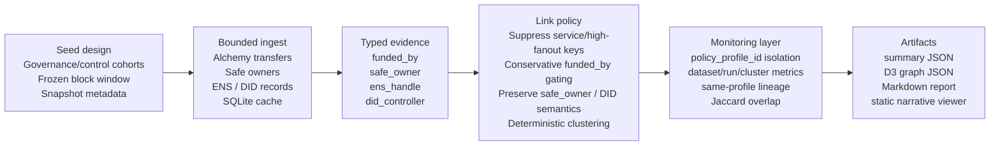

# unmasking-did

> Measuring the gap between decentralized identifiers and decentralized entities.


`unmasking-did` is an auditable, evidence-based coordination analysis pipeline.
It is **not** Sybil detection, deanonymization, or real-world identity attribution.

## Architecture (high-level)



The main design constraint is semantic conservatism: `funded_by` is useful
coordination evidence, but it is not identity evidence. The linker therefore
suppresses service-like keys and only allows `funded_by`-only merges under
repeated, short-window conditions. Stronger structural evidence such as
`safe_owner` and `did_controller` is kept separate from claims about real-world
people.

## Quickstart (canonical run)

```bash
cp .env.example .env
# set ARBITRUM_ALCHEMY_API_KEY (or fallback ALCHEMY_API_KEY)

cargo run --release -- phase2-arbitrum-gov --overwrite-db
make serve-viewer
# open http://localhost:8000/viewer/index.html
```

## Canonical outputs

- `out/phase2_arbitrum_gov_summary.json`
- `out/phase2_arbitrum_gov.graph.json`
- `out/phase2_arbitrum_gov_report.md`

The static viewer reads these artifacts directly. It does not query RPC, does
not re-run clustering, and does not render the historical baseline graph; the
baseline section is metrics-only.

## Evidence semantics

- `funded_by`: weak coordination signal. Dangerous by itself because bridges,
  routers, faucets, CEXes, relayers, and batch distributors can create giant
  artificial clusters.
- `safe_owner`: control-relation signal. Useful for explaining shared control,
  but not a claim that addresses are the same person or entity.
- `ens_handle`: off-chain handle evidence when available.
- `did_controller`: stronger controller evidence when explicitly recorded or
  resolved, but still reported as evidence, not as real-world identity.

## Monitoring semantics

Runs are identified by `run_id` and grouped by `policy_profile_id`. Lineage is
only comparable within the same chain and policy profile, using configurable
Jaccard thresholds for `stable` and `related` cluster overlap. If no prior
same-profile run exists, lineage is recorded as skipped rather than inferred.

## Key docs

- Run spec: [docs/run-spec-arbitrum-gov-90d.md](docs/run-spec-arbitrum-gov-90d.md)
- Findings: [docs/findings/arbitrum-governance-coordination-v0.md](docs/findings/arbitrum-governance-coordination-v0.md)
- Monitoring spec: [docs/phase3_monitoring_product_spec.md](docs/phase3_monitoring_product_spec.md)

## License

MIT — see [LICENSE](LICENSE).
